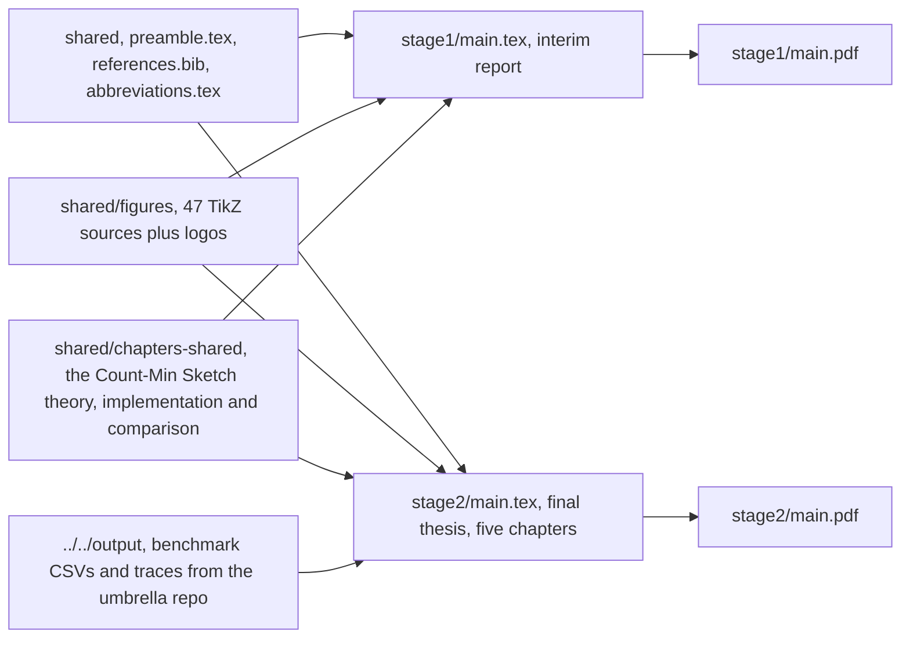

# K8sSecDaP-report

The LaTeX sources for the graduation thesis behind
[K8sSecDaP](https://github.com/john-naeder/K8sSecDaP) — port-scan detect-and-prevent on
bare-metal Kubernetes. Written in Vietnamese, for Học viện Kỹ thuật Mật mã.

This repo is the document, not the system. It is here because the thesis is the artefact the
project was assessed on, and because a fair amount of the engineering work is in it: 47 TikZ
figures, two builds sharing one chapter and figure library, and a set of numbers that are
generated by the code rather than typed in.

## How the two reports share sources



`stage2/main.tex` defines `\outputDir` as `../../output`, which resolves into the umbrella
repo. Plots and traces in the evaluation chapter therefore read the same CSV files the
benchmarks wrote — `output/bench/throughput.csv`, `output/bench/error_rate.csv`,
`output/portscan/comparison.csv` — rather than a copy pasted into the document. Re-running the
benchmarks and rebuilding the PDF is enough to update the numbers, which is the only way to
keep a results chapter honest over a long project.

That also means **`report/` does not build standalone.** It has to be checked out as a
submodule of the umbrella repo, or the plots will not find their data.

## Layout

```
stage2/main.tex          the final thesis: overview, foundations, design, implementation,
                         evaluation and conclusion
stage2/chapters/         those five chapters
stage2/appendices/       source listings: CMS, eBPF, Tarjan and BFS, SQL schema, web console,
                         and the demo transcript
stage2/assets/           screenshots of the console, Grafana and the cluster
stage1/                  the interim report, same structure, fewer chapters
shared/preamble.tex      document class setup, fonts, bibliography
shared/references.bib    the bibliography for both
shared/abbreviations.tex the abbreviation table the faculty format requires
shared/chapters-shared/  chapters included by both reports
shared/figures/          47 .tex figures: C4 and DFD levels 0 to 2, the eBPF execution model,
                         kprobe placement in the TCP stack, BPF map layout, the CMS structure,
                         LPM trie, BFS layers, the kill chain, deployment topology, ERD,
                         and the evaluation plots
```

## Build

LuaLaTeX and Biber. From the umbrella repo:

```bash
make bc1        # cd report/stage1 && latexmk -pdf main.tex
make bc2        # cd report/stage2 && latexmk -pdf main.tex
```

Or directly:

```bash
cd stage2 && latexmk -lualatex main.tex
```

LuaLaTeX rather than pdfTeX because the document uses system fonts for Vietnamese diacritics.
Aux files are gitignored; the PDFs are committed so the built document is available without a
TeX installation.

## Limits

- **`report-compile.sh` is stale.** It `cd`s into `report/stage1`, a path that only exists from
  the umbrella repo's root, and the `stage2` line is commented out. Use `latexmk`, or the
  umbrella `Makefile`.
- **`main.bbl-SAVE-ERROR` is committed in both stages** — the residue of a Biber failure that
  was worked around rather than fixed. It should be deleted.
- **`shared/figures/logos/` still carries Calico and Tekton logos.** Both technologies were
  removed from the system in August 2026; any figure still drawing them is out of date with
  respect to the code.
- **Vietnamese only.** There is no English version of the thesis and none is planned. The
  English summary of the system is the umbrella repo's README.
